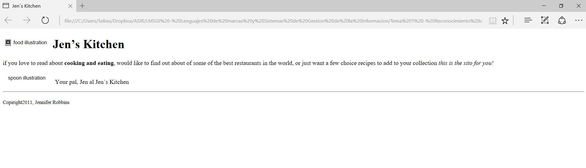
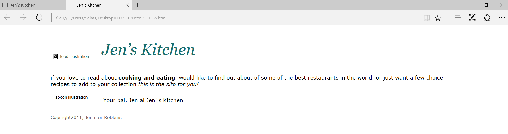
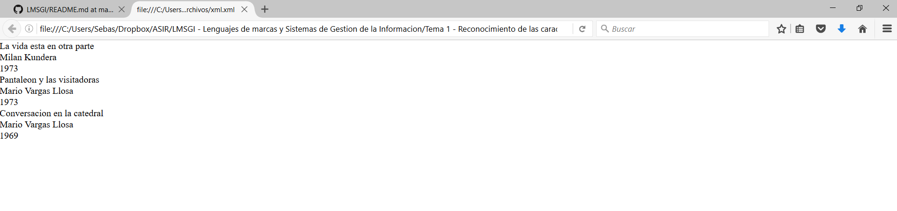
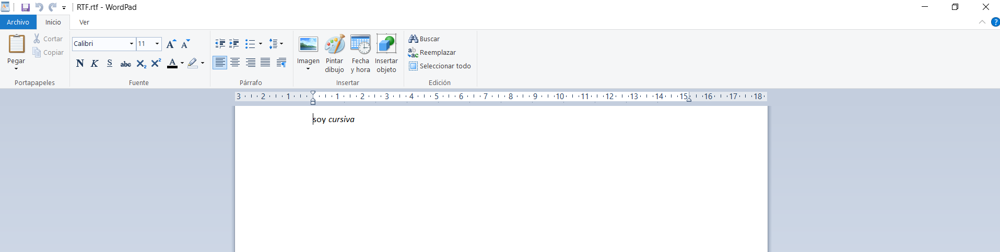
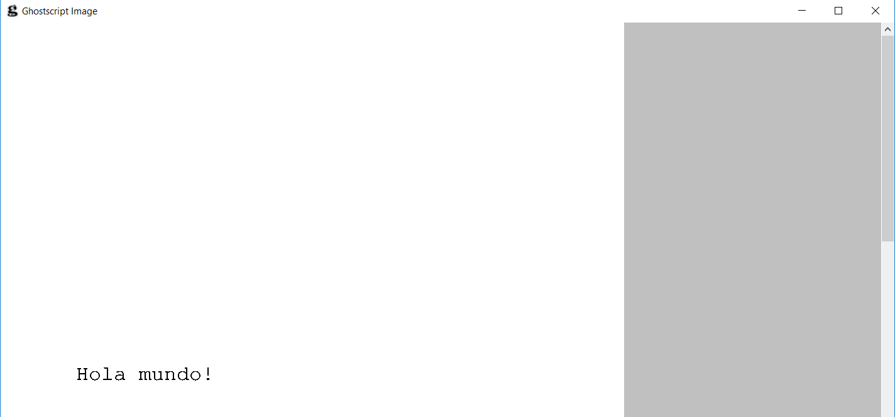

# LMSGI Tarea 1
#### Creación de repositorio y publicación de archivos creados
Para la realización de la tarea se han seguido los siguientes pasos:
* Crear un documento de texto plano con el `Bloc de notas` de Windows, con el código de cada uno de los leguajes de marcas incluidos en el contenido del temario.
* Modificar la extensión del archivo creado para hacerla coincidir con el código de lenguaje de marcas que contiene. Concretamente se han creado los siguientes archivos finales:
 * _HTML.html_
 * _HTML CON CSS.html_
 * _CSS.css_
 * _XML.xml_
 * _RTF.rtf_
 * _PS.ps_
* Probar el funcionamiento en la aplicación apropiada.
Crear un repositorio en [_Github_](www.github.com), subir los archivos creados y redactar una explicación de lo realizado modificando para ello el archivo _readme.md_ contenido en el repositorio.

#### HTML (Lenguaje de marcas de hipertexto, del inglés _HyperText Markup Language_)

Utilizando el navegador `Safari`, el resultado obtenido con el código redactado en el archivo _HTML.html_ es el que muestra la siguiente imagen:

#### HTML con CSS (Hoja de estilo en cascada, del inglés de _Cascading Style Sheets_)

Para probar el funcionamiento del código escrito en el archivo _CSS.css_, se ha modificado el documento _HTML.html_ para enlazarlos y que se aplicaquen los atributos en el primero establecidos, generando un nuevo archivo llamado _HTML CON CSS.html_. De la misma manera que con el archivo anterior se ha utilizado el navegador `Safari` para probar su funcionamiento, obteniendo el siguiente resultado:

>Para enlazar los CSS se han seguido los pasos relacionados en esta web: http://librosweb.es/foro/pregunta/16/como-enlazar-los-css-con-html/>

#### XML con CSS (Lenguaje de marcas extensible, del inglés _eXtensible Markup Language_)

Dado que el los contenidos del temario no existe código alguno escrito en _XML_, se ha utilizado uno descargado de `Internet`, vinculándolo a un archivo _CSS_ para probar su funcionamiento en el navegador. Se han generado dos archivos, el primero llamado _XML.xml_ con el código y el segundo _CSS PARA XML.css_ con la hoja de estilos para el primero, obteniendo el siguiente resultado al ejecutarlo con `Safari`:

>Página consultada y que contiene el código _HTML_ y _CSS_: http://www.mclibre.org/consultar/xml/lecciones/xml_css.html

#### RFT (Formato de texto enriquecido, del inglés _Rich Text Format_) 

Tras crear el archivo con el `bloc de notas` y cambiar la extensión a _.rtf_ se genera el documento llamado _RTF.rtf_, probando su funcionamiento con la aplicación `wordpad` con el siguiente resultado:

#### PS (Lenguaje de descripción de páginas o Postscript, en inglés _Page Description Language PDL_)

Una vez generado el archivo _PS.ps_ conteniendo el código, es necesario un visor para comprobar su funcionamiento. Se selecciona el visor llamado [Ghostscript](http://www.ghostscript.com/) y, tras instalarlo y utilizarlo para abrir el documento _.rft_, podemos visualizar el funcionamiento del código creado:

>Además de los archivos mencionados anteriormente, en el repositorio también se han subido las imágenes correspondientes a las capturas de pantalla probando el funcionamiento de cada uno de los idiomas y que han servido para ilustrar esta explicacón. Los archivos de imagen creados son:
1. HTML.png
2. HTML CON CSS.png
